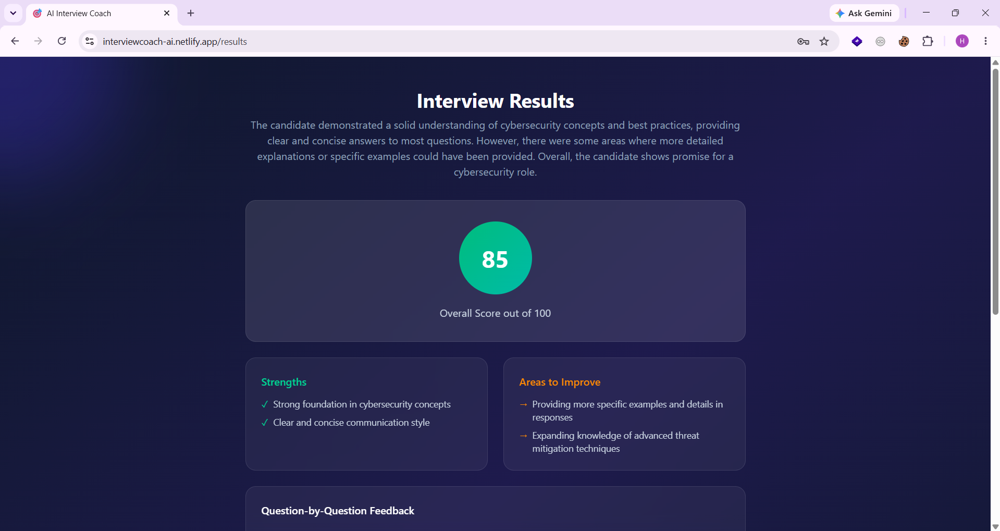
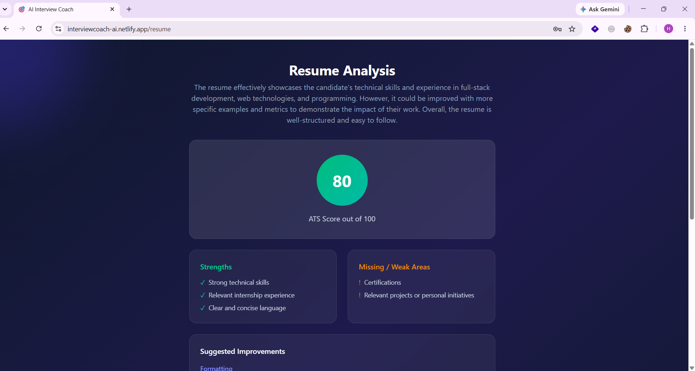

# 🎯 AI Interview Coach

An AI-powered full-stack platform that helps job seekers prepare for interviews through mock interviews, resume analysis, and coding practice — all with real-time AI feedback.

**🔗 Live Demo:** [interviewcoach-ai.netlify.app](https://interviewcoach-ai.netlify.app)
**🔗 Backend API:** [ai-interview-coach-backend-950s.onrender.com](https://ai-interview-coach-backend-950s.onrender.com)

---

## ✨ Features

- 🔐 **Secure Authentication** — JWT-based auth with bcrypt password hashing
- 🎤 **AI Mock Interviews** — Dynamic HR/Technical questions with detailed scored feedback
- 📄 **Resume Analysis** — AI-powered ATS scoring, strengths, and improvement suggestions
- 💻 **Coding Practice** — Multi-language code review with correctness, efficiency, and quality scoring
- 📊 **Dashboard** — Real-time stats tracking across all activities
- 📜 **History** — Complete activity log of past interviews, resumes, and code submissions
- 👤 **Profile Management** — Update info, change password, account deletion

---

## 🛠️ Tech Stack

**Frontend**
- React (Vite)
- Tailwind CSS
- React Router

**Backend**
- Python Flask
- JWT & Bcrypt for authentication

**Database**
- MongoDB Atlas

**AI**
- Groq (Llama 3.3 70B) for question generation, feedback, and code review

**Cloud Services**
- Render (Backend hosting, CI/CD)
- Netlify (Frontend hosting, CDN)
- Cloudinary (Resume file storage)
- MongoDB Atlas (Database as a Service)

---

## 🏗️ Architecture

Frontend (React/Netlify) 
→ REST API calls →
Backend (Flask/Render)
→ connects to →
MongoDB Atlas (Database), Groq AI API (AI Inference), Cloudinary (File Storage)

---

## 📸 Screenshots

| Home | Dashboard |
|------|-----------|
|  |  |

| Interview Results | Resume Analysis |
|--------------------|------------------|
|  |  |

---

## 🚀 Getting Started (Local Setup)

### Prerequisites
- Node.js (v18+)
- Python 3.10+
- MongoDB Atlas account
- Groq API key
- Cloudinary account

### Backend Setup

```bash
cd backend
python -m venv venv
venv\Scripts\activate
pip install -r requirements.txt
```

Create a `.env` file in `backend/`:

MONGO_URI=your_mongodb_connection_string
JWT_SECRET=your_random_secret
GROQ_API_KEY=your_groq_key
CLOUDINARY_CLOUD_NAME=your_cloud_name
CLOUDINARY_API_KEY=your_api_key
CLOUDINARY_API_SECRET=your_api_secret

Run:

```bash
python app.py
```

### Frontend Setup

```bash
cd frontend
npm install
```

Create a `.env` file in `frontend/`:

VITE_API_URL=http://localhost:5000

Run:

```bash
npm run dev
```

---

## 🔒 Security Features

- Passwords hashed with bcrypt (never stored in plain text)
- JWT-based session management
- Protected routes on both frontend and backend
- Environment variables for all secrets (never committed to git)

---

## 📝 Author

**Hasin Jishan**
[GitHub](https://github.com/HasinJishan)

---

## 📄 License

This project is for educational purposes as part of a final year academic project.